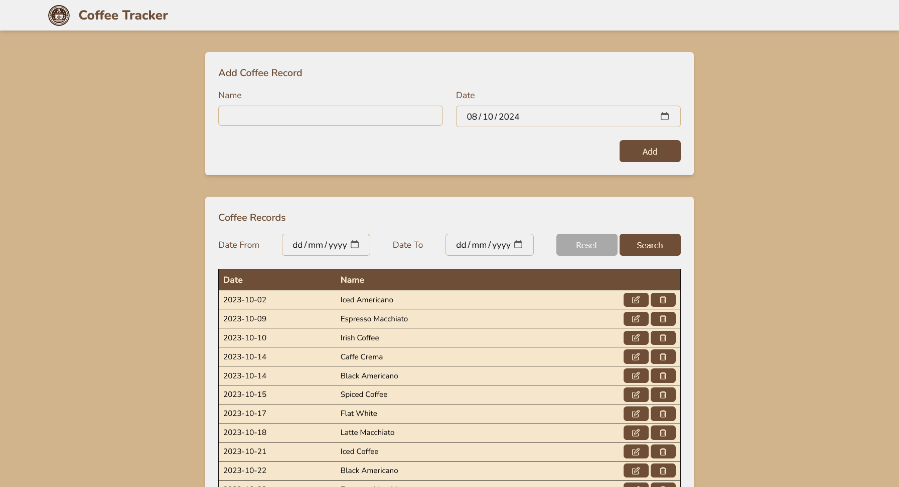
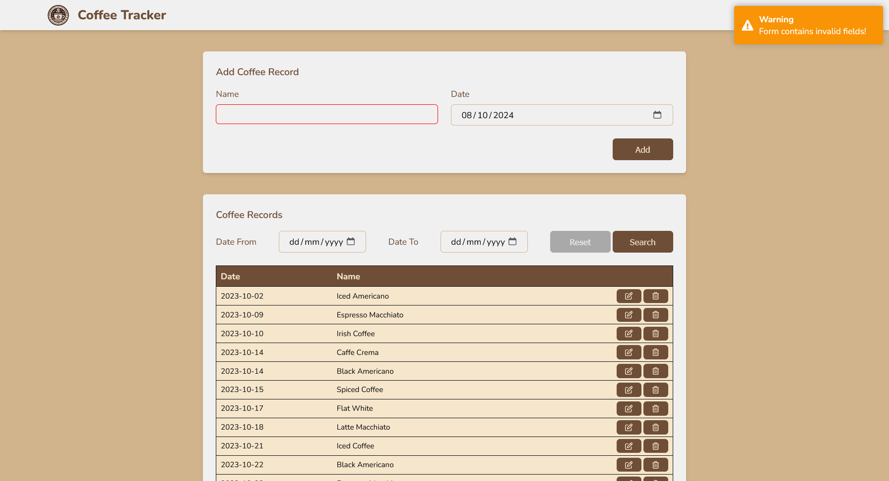
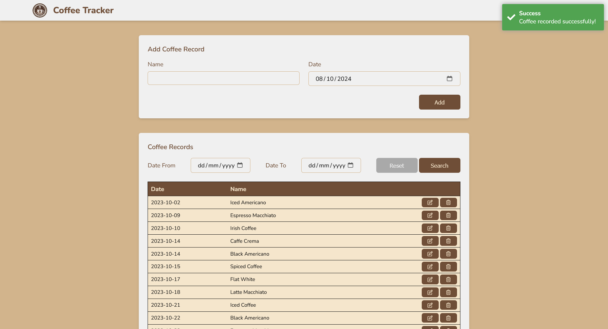
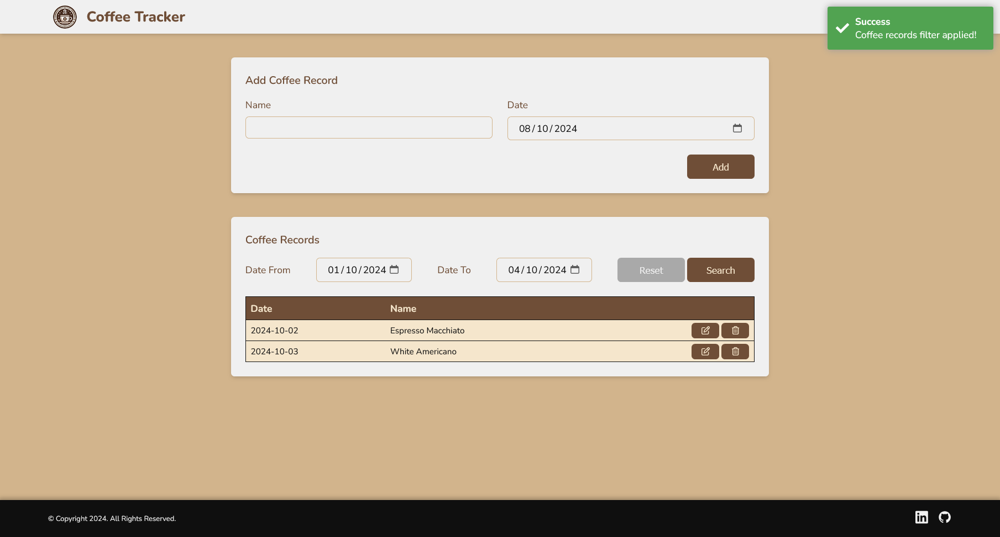
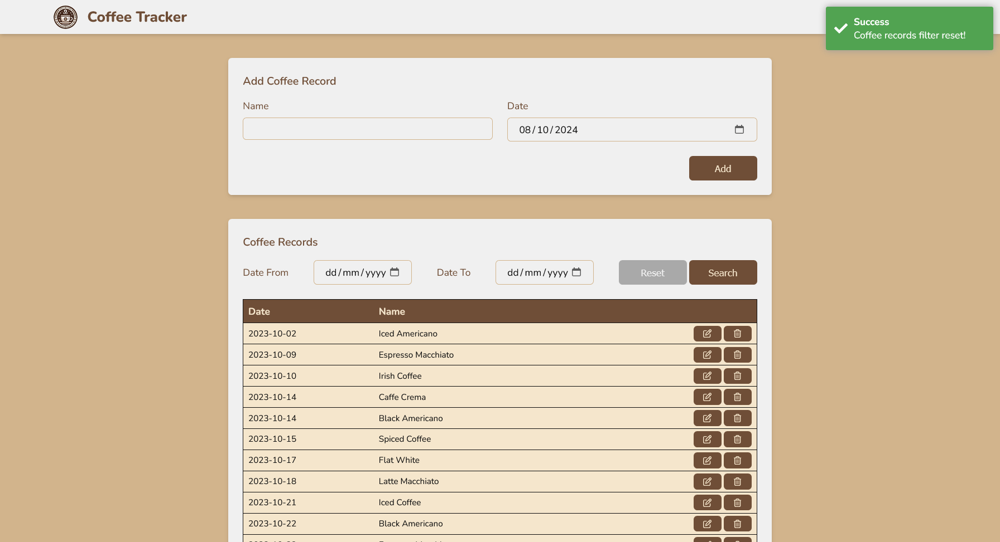
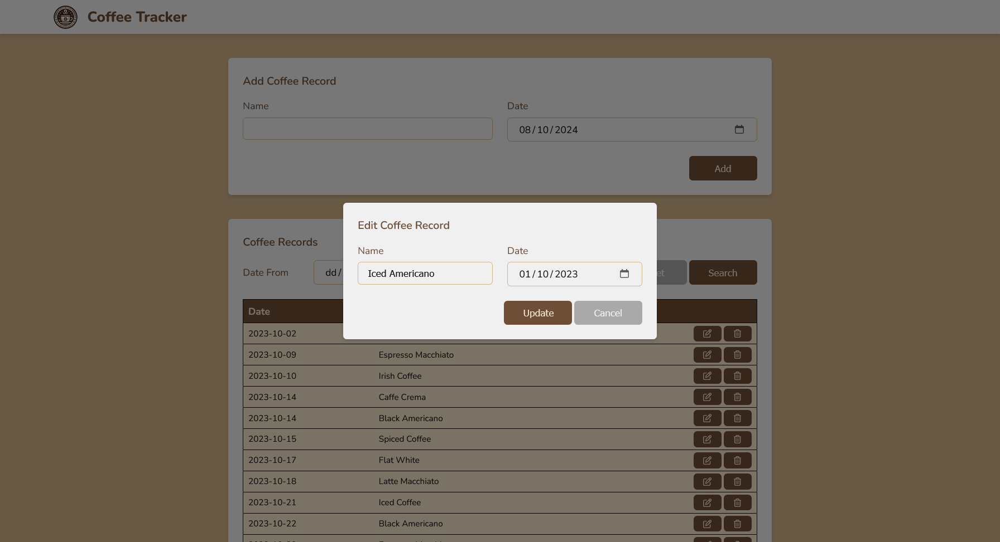
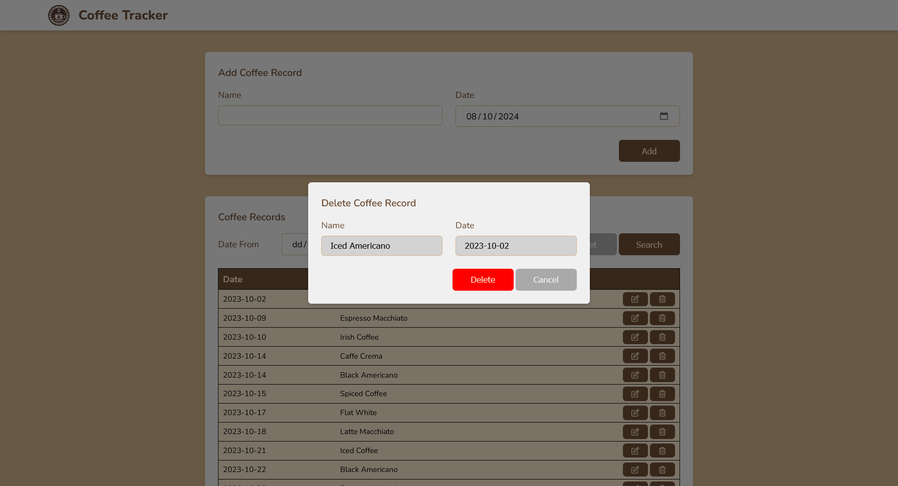
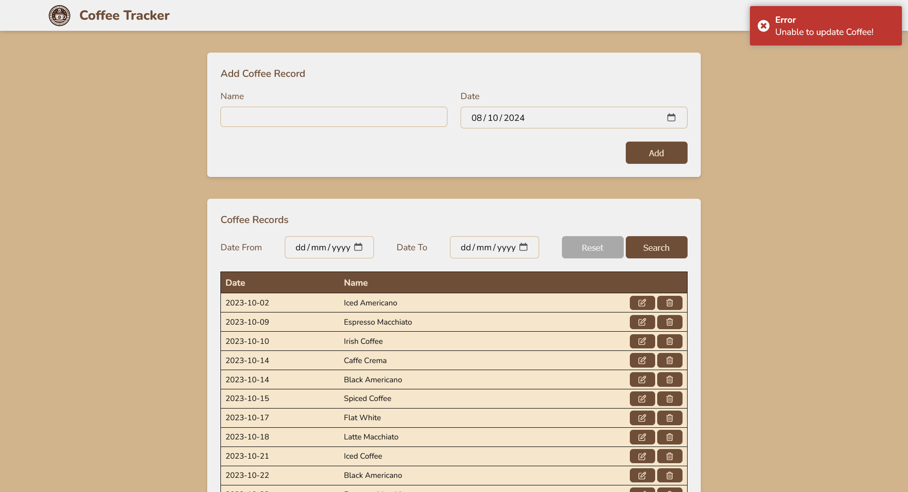
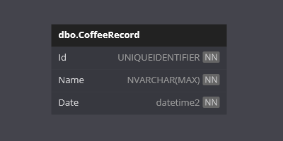

	
	<h1>Coffee Tracker</h1>

Welcome to the **Coffee Tracker** App!

This is a .NET and Angular project designed to demonstrate combining the two framework via API.

It allows users to visualise their coffee intake. They can add, update and delete records. They can also view and filter the records. It uses an external API to perform CRUD operations on a database.

## Features

- **Navigation**:
	- The only defined route is for the Home page.
- **Modals**:
	- The edit and delete pages are implemented as modals.
- **Form Validation**:
	- Form validation will ensure correct values before form submission.
- **Toatr**:
	- Displays success, error and warning toasts when performing actions.
- **External API**:
	- The coffee records service interfaces with an API.
- **Versioned API**:
	- The CoffeeTracker.Api is a versioned API allowing for future feature expansion.
- **Entity Framework Core**:
	- Entity Framework Core is used as the ORM.
- **SQL Server**:
	- SQL Server is used as the data provider.
- **Responsive Web Design**: 
	- A user-friendly web interface designed to work on various devices.

## Technologies

- .NET
- Angular
- HTML
- CSS
- TypeScript
- Entity Framework Core
- SQL Server

## Getting Started

**IMPORTANT NOTE**: 

The `InitialCreate` database migration has been created.

On start-up of the **API** application, any required database creation/migrations will be performed.

### Prerequisites

- .NET 8 SDK.
- Angular v18.
- A code editor like Visual Studio or Visual Studio Code.
- SQL Server.
- SQL Server Management Studio (optional).
- Node.js.
- NPM.

### Installation

1. Clone the repository:
	- `git clone https://github.com/chrisjamiecarter/coffee-tracker.git`

2. Navigate to the API project directory:
	- `cd src\CoffeeTracker.Api`
	
3. Configure the application:
	- Update the connection string in `appsettings.json` if required.
	
4. Build the application using the .NET CLI:
	- `dotnet build`

5. Navigate to the Web project directory:
	- `cd src\CoffeeTracker.web`

6. Install dependencies:
	- `npm install`

### Running the Application

1. You can run both applications from Visual Studio, using the **Multiple Startup Projects** option and selecting the *.Api and *.web projects.

OR

1. Run the API application using the .NET CLI in the API project directory:
	- `cd src\CoffeeTracker.Api`
	- `dotnet run`

2. Start the development server in the Web project directory:
	- `cd src\coffeetracker.web`
	- `npm start`

## Usage

Once the Web application is running:

- View a list of Coffee Records.
- Filter the list of Coffee Records.
- Add a new Coffee Record.
- Edit a Coffee Record.
- Delete a Coffee Record.
- If an Error message is returned, check API is running, check port running on.

### Coffee Tracker

### Add Coffee Record Form

### Add Coffee Record Form Validation

### Add Coffee Record Form Success

### Coffee Records Filter

### Coffee Records Filter Reset

### Edit Coffee Record

### Delete Coffee Record

### Error Toast

## How It Works

- **Page Display**: This project was bootstrapped via `create-react-app` and uses React to render the components of the web application.
- **Page Display**: This project was generated with [Angular CLI](https://github.com/angular/angular-cli) version 18.2.6.
- **State Management**: Redux is used to manage the state within the web application.
- **API Integration**: Fetch is used to call the External API.
- **Data Storage**: A new SQL Server database is created and the required schema is set up at run-time, or an existing database is used if previously created.
- **Data Access**: Interaction with the database is via Entity Framework Core.

## Database

## Contributing

Contributions are welcome! Please fork the repository and create a pull request with your changes. For major changes, please open an issue first to discuss what you would like to change.

## License

This project is licensed under the MIT License. See the [LICENSE](./LICENSE) file for details.

## Contact

For any questions or feedback, please open an issue.

---
***Happy Friends Managing!***
